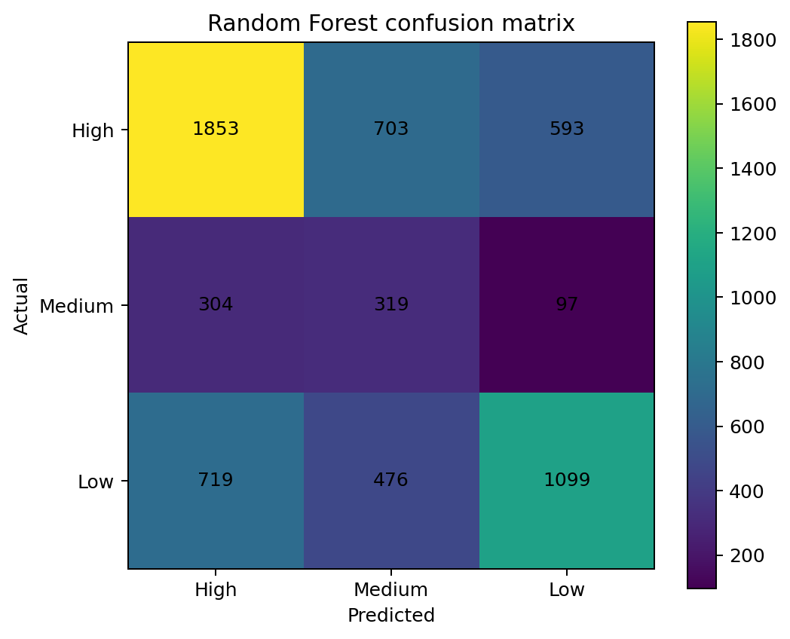
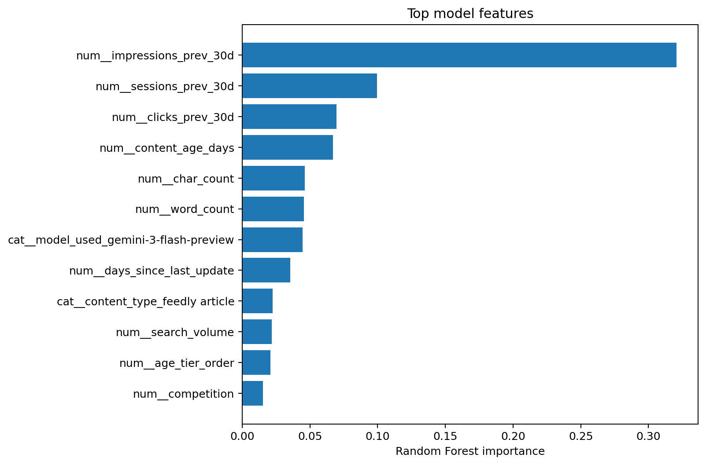
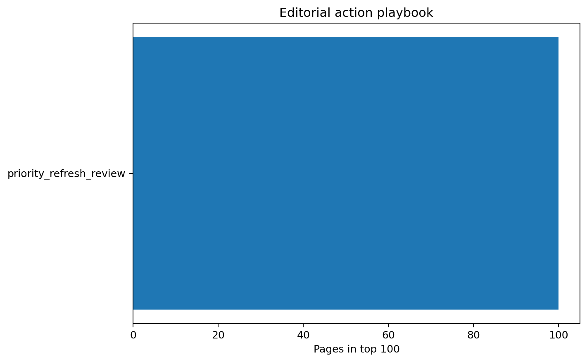

# Search Intelligence for Content Refresh Prioritization Using Machine Learning

## FlyRank Machine Learning Internship Capstone

**Lane:** Refresh / Content Opportunity Scoring  
**Author:** Karthikk P S  
**Repository:** https://github.com/pskarthikk/flyrank-ml-internship

## Abstract

This capstone asks which content pages should be prioritized for review so editors can focus on pages with the highest measured potential for improvement.

Using the supplied FlyRank 30,000-record Search Intelligence dataset, the workflow audits the data, defines a three-level refresh-priority label from observed trend information, and trains a Random Forest using structural, content, and market attributes that are excluded from target construction.

The model is evaluated on a client-grouped holdout containing 7 unseen clients, with preprocessing fitted only on training data and target-generating performance variables excluded from the feature set.

The leakage-audited Random Forest achieved 53.07% accuracy and 50.35% balanced accuracy, compared with 51.10% and 33.33% for the majority baseline.

The resulting ranking is directional editorial decision support: high-scoring pages should be reviewed first, verified by editors, and evaluated separately if a refresh intervention is later performed.

## 1. Introduction / Problem statement

The decision supported by this project is editorial prioritization: which pages should enter the review queue first when the goal is to identify pages with stronger measured refresh opportunity. The output is decision support and does not automatically publish or edit content.

## 2. Data

The supplied FlyRank Search Intelligence dataset contains 30,000 records and 44 columns. Public outputs contain no client names, domains, private queries, credentials, or raw exports.

## 3. Methodology

### Target

High priority means observed downward trend with trend_pct <= -20%; Medium means a downward or negative trend not meeting the High threshold; Low otherwise.

### Leakage control

The last 30-day outcome fields, trend fields, 90-day totals, ambiguous observed performance aggregates, performance-derived tiers, and identifiers were excluded. Previous-30-day metrics are used as the pre-outcome feature window.

### Validation

20% client-grouped holdout with random seed 42. No client appears in both train and test.

### Model

Random Forest with training-fitted median imputation and one-hot encoding.

## 4. Results

| Method            |   Accuracy |   Balanced Accuracy |   Macro F1 |   Weighted F1 |
|:------------------|-----------:|--------------------:|-----------:|--------------:|
| Random Forest     |     0.5307 |              0.5035 |     0.4804 |        0.5483 |
| Majority baseline |     0.511  |              0.3333 |     0.2254 |        0.3456 |

The leakage-audited Random Forest achieved 53.07% accuracy and 50.35% balanced accuracy, compared with 51.10% and 33.33% for the majority baseline.

### Feature importance

| feature                                |   importance |
|:---------------------------------------|-------------:|
| num__impressions_prev_30d              |      0.32058 |
| num__sessions_prev_30d                 |      0.09941 |
| num__clicks_prev_30d                   |      0.06957 |
| num__content_age_days                  |      0.06704 |
| num__char_count                        |      0.04603 |
| num__word_count                        |      0.04565 |
| cat__model_used_gemini-3-flash-preview |      0.04463 |
| num__days_since_last_update            |      0.03531 |
| cat__content_type_feedly article       |      0.02256 |
| num__search_volume                     |      0.02181 |
| num__age_tier_order                    |      0.02066 |
| num__competition                       |      0.01539 |

## 5. Limitations & honest framing

The supplied reference paper reports 80.85% accuracy, but that number is not reused as the final claim because the reference implementation leaves outcome-related performance variables in the feature table. This final experiment uses a temporal feature policy and client-grouped validation.

These findings are association-based decision support. They do not prove Google's ranking algorithm, causal refresh impact, guaranteed traffic recovery, or revenue impact.

## 6. Ranked recommendations

1. Start review with the highest model priority scores.
2. Check reason codes and observed trend.
3. Verify the page manually before editing.
4. Treat the suggested action as a review recommendation.
5. Evaluate any later refresh outcome separately.

| action                  |   pages |
|:------------------------|--------:|
| priority_refresh_review |     100 |

## 7. Reproducibility

- Notebook: `work/notebooks/FinalCapstone.ipynb`
- Dataset: 30,000 × 44 supplied FlyRank Search Intelligence dataset
- Seed: 42
- Validation: 20% client-grouped holdout
- Model: Random Forest
- Repository: https://github.com/pskarthikk/flyrank-ml-internship

## 8. Acknowledgments & data credit

**Built on the FlyRank ML Internship dataset.**

Data source: https://flyrank.ai

## Public-safety statement

No client names, domains, private queries, credentials, or raw exports are published. Findings are framed as observed, directional, and decision-support evidence.